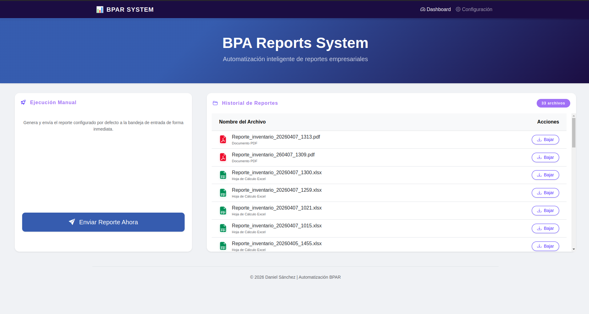
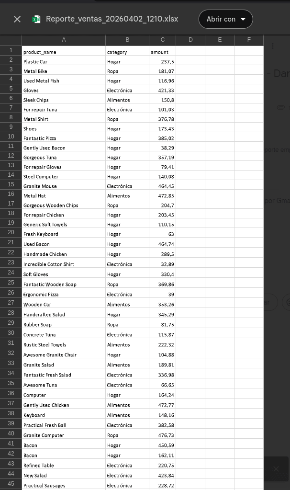

# 👋 Hola, soy Daniel
Desarrollador especializado en automatización de procesos y creación de herramientas internas para empresas.

Automatizo tareas repetitivas como generación de reportes, gestión de datos y procesos entre sistemas, ayudando a reducir tiempos y errores.

---

## 🚀 Qué hago
- Automatización de reportes empresariales
- Procesamiento y transformación de datos
- Integración entre sistemas y APIs
- Automatización de tareas repetitivas

---

## 💼 Proyectos principales

### 📊 Automatización de reportes empresariales

Sistema que genera y envía reportes automáticamente desde una interfaz web.

**Qué hace:**
- Genera archivos Excel o PDF automáticamente
- Envía los reportes por email
- Permite la ejecución manual desde el dashboard

**Tecnologías:** FastAPI, SQL, Pandas, SQLAlchemy

🔗 https://github.com/Skar25-dev/business-process-automation-reports

Dashboard de la web.

Previsualización del excel generado desde la web

---

## 🧪 Otros proyectos

### 🚗 Kilometros Y Centimos

Aplicación para llevar el control del gasto en combustible desde el teléfono.

**Qué hace:**
- Lleva el control del gasto de combustible de cada coche que ponga el usuario
- Controla también el kilometraje y el gasto en talleres
- Permite el reconocimiento por IA de los tickets de la gasolinera para no tener que introducir la información de manera manual

**Tecnologías:** Dart, Google OCR

🔗 https://github.com/Skar25-dev/KilometrosYCentimos

### 🗓️ Calendario Laboral

Pequeña aplicación para llevar el control de los turnos del trabajador con distintos tipos de turnos disponibles.

**Qué hace:**
- Lleva el control de los turnos del usuario
- Permite generar un archivo Excel para ver mejor los turnos del usuario
- Permite el control total a la hora de personalizar el calendario

**Tecnologías:** C#

🔗 https://github.com/Skar25-dev/CalendarioLaboral

### 🏎️ F1 Steward Bot
Modelo de Inteligencia Artificial al que se le pasa la imagen de un accidente de la Fórmula 1 y te dice automáticamente el culpable y porqué.

**Qué hace:**
- Usa la imagen de un accidente para buscar los posibles culpables
- Una vez sacados los culpables se mira que articulos del reglamento se incumplen
- Una vez decidido todo se dicta la posible sanción a cumplir

**Tecnologías:** Python, Torch, Torchvision, YOLO

🔗 https://github.com/Skar25-dev/F1-StewardBot

---

## 📬 Contacto

📧 sanchezdaneri@gmail.com
💼 LinkedIn: https://www.linkedin.com/in/daniel-sanchez-daneri/

---

## 🎯 Objetivo

Ayudar a empresas a automatizar procesos internos y eliminar tareas manuales repetitivas.
